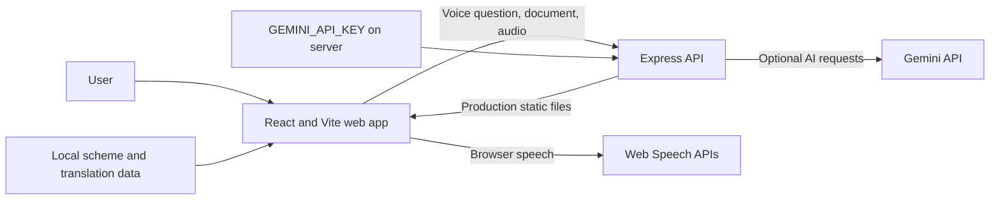
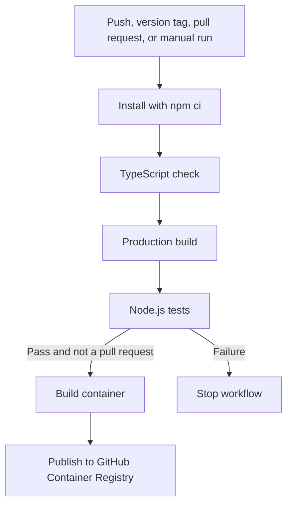

# Saheli AI

Saheli AI is a multilingual voice companion that helps women who are applying for government schemes for the first time. It explains scheme benefits, eligibility, documents, and where to apply; supports spoken questions; reads uploaded notices; and offers private practice conversations before an office visit.

## Features

- Voice-first questions and spoken answers, with browser speech support and optional Gemini-powered responses.
- Scheme guidance in Hindi, Tamil, Telugu, Bengali, Marathi, Gujarati, Kannada, Malayalam, Punjabi, and English.
- Scheme details with eligibility, benefits, document checklists, and suggested places to apply.
- Document-photo explanations and guided practice for conversations with public-service staff.
- Essential scheme information remains available without a Gemini API key; AI-backed features require one.

Scheme information is provided as a starting point, not a guarantee of eligibility or benefits. Confirm current requirements with the relevant official government office or portal.

## Requirements

- Node.js 22 or newer
- npm
- A Gemini API key for Gemini-backed voice, document, and answer features

## Run locally

```bash
npm ci
```

Create a `.env` file in the project root and set the server-side key:

```dotenv
GEMINI_API_KEY=your_gemini_api_key
PORT=3000
```

Start the development server:

```bash
npm run dev
```

Open `http://localhost:3000`. The key is read only by the Express server; do not put it in a `VITE_*` variable or commit it.

## Scripts

| Command | Purpose |
| --- | --- |
| `npm run dev` | Start the Express server with Vite development middleware. |
| `npm run lint` | Type-check the TypeScript project. |
| `npm run build` | Build production frontend assets into `dist/`. |
| `npm test` | Run the Node.js test suite, including the production health endpoint smoke test. |
| `npm run start` | Start the server; set `NODE_ENV=production` to serve the built frontend. |

Run the production app locally:

```bash
npm run build
```

```bash
NODE_ENV=production npm run start
```

On PowerShell, set the environment variable with `$env:NODE_ENV="production"` before running `npm run start`.

## Architecture



The browser handles the interface and native speech playback. Express serves the frontend and provides the AI-backed endpoints. Scheme data and translations are bundled locally, while the Gemini key remains on the server.

## API

| Method | Path | Purpose |
| --- | --- | --- |
| `GET` | `/healthz` | Returns `200` and `{ "status": "ok" }` when the server is running. |
| `POST` | `/api/saheli/voice-query` | Answers a spoken or typed scheme question. |
| `POST` | `/api/saheli/inspect-document` | Explains an uploaded document image. |
| `POST` | `/api/saheli/transcribe-audio` | Transcribes uploaded audio. |
| `POST` | `/api/saheli/tts` | Generates speech audio when available, otherwise indicates browser-voice fallback. |

## CI/CD

The GitHub Actions workflow runs on pushes to `main`, version tags, pull requests targeting `main`, and manual dispatch. It installs from the npm lockfile, type-checks, builds, and runs tests. Container publishing depends on successful verification and is skipped for pull requests.



Images are published to `ghcr.io/<owner>/<repository>` with branch, semantic-version, `latest` (default branch), and commit-SHA tags. The workflow uses the repository-provided `GITHUB_TOKEN`; no registry password needs to be configured. To run a published image, provide `GEMINI_API_KEY` as a runtime environment variable and expose port `3000`:

```bash
docker run --rm -p 3000:3000 -e GEMINI_API_KEY=your_gemini_api_key ghcr.io/<owner>/<repository>:latest
```

The image does not contain the API key. Configure it through the container platform's secret or environment-variable settings.

## Project layout

```text
src/
   components/     React views and dialogs
   data/           Scheme data, translations, and languages
   utils/          Browser speech helpers
   App.tsx         Main application
server.ts         Express API and Vite/production server
test/             Node.js integration smoke tests
.github/workflows GitHub Actions CI/CD
```

## Security and privacy

- Keep `GEMINI_API_KEY` in an untracked `.env` file for local development and in a secret manager in hosted environments.
- Uploaded document images and audio may be sent to Gemini when the related AI feature is used. Do not upload sensitive documents unless you understand the provider's data handling terms.
- The health endpoint contains no secrets and does not call external services.
